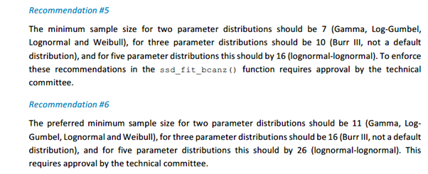
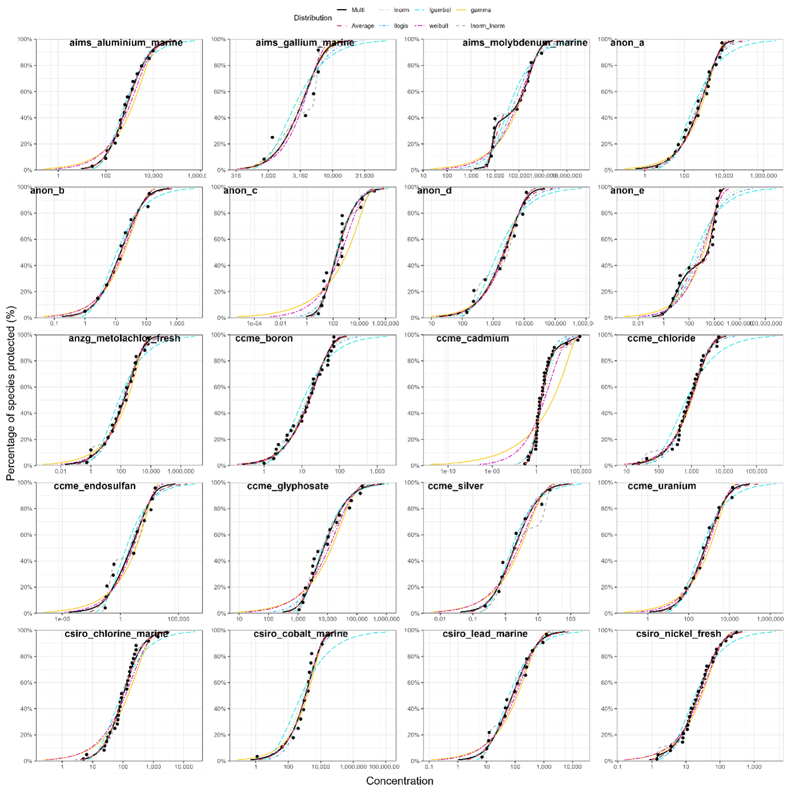
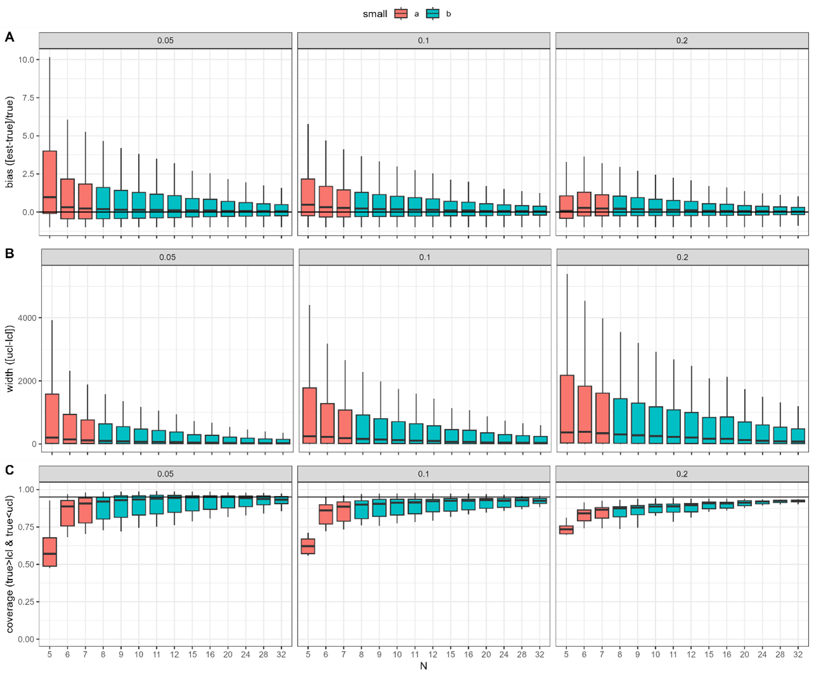
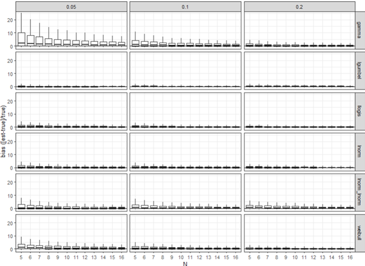
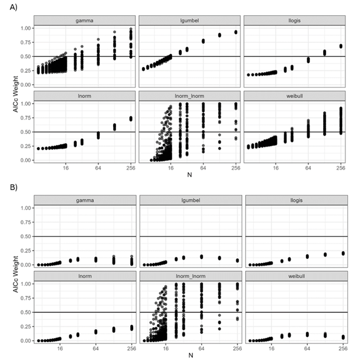

```{r setup, include=FALSE}
knitr::opts_chunk$set(echo = TRUE)
```

## Background

In the final report of the “Joint Investigation into SSD Modelling and ssdtools Implementation for the Derivation of Toxicant Guidelines Values in Australia and New Zealand”, prepared for the Department of Climate Change, Energy, the Environment and Water (Fox, et al. 20204) several key recommendations were made regarding minimum sample sizes  required for fitting the default candidate distributions in ssdtools with a view to adoption by the Australian, New Zealand and Canadian jurisdictions.
These recommendations were as follows:



Recommendation #5 has ramifications for both the current ANZG minimum of 5 (Warne et al. 2018, ANZG 2020), as well as the current default minimum sample size of 6 for version 1.0 of ssdtools (Thorley and Schwarz 2018), which is consistent with the current methodology for British Columbia (BC Ministry of Environment and Climate Change Strategy 2019). 
He we report on a series of simulation studies designed to inform a final decision on the default minimum sample size for both the uni-modal 2 parameter distributions, as well as the bi-modal 5 parameter distributions.

## Methods

We used the example datasets in the ssddata package in R (Fisher & Thorley 2021) to undertake a simulation study to examine bias, coverage and confidence interval width using the recommended default set of distributions (lognormal, log-Gumbel, log-logistic, gamma, Weibull, and the lognormal-log-normal mixture), with model averaged estimates obtained using the multi-method, and confidence intervals estimated using the recommended weighted sample bootstrap method (see Fox et al. 2024). A total of 20 unique datasets were extracted from ssddata and used to define the parameters for simulation study as follows:

  1.	Each dataset was extracted from ssddata and fit using the default distribution set as recommended in Fox et al. 2021 and Fox et al. 2024. The individual fits as well as the model average fits are shown in (Figure 1).
  2.	Of the six default distributions, the parameters for the distribution having the highest weight for each dataset was used to generate new random datasets of varying values of N, including (but not limited to): 5 (current ANZG minimum), 6 (current BC minimum), 7 (recommended new minimum and Canadian minimum), 8 (current ANZG preferred), 10 (recommended new preferred), 16 (recommended 5 parameter minimum) and 26 (recommended 5 parameter distribution preferred).
  3.	For each randomly generated dataset, ssdtools was used to re-fit the data, and model averaged estimates were obtained using the multi-method, and upper and lower confidence intervals estimated using the recommended weighted sample method.

This simulation process was repeated a minimum of 1,000 times for each dataset, and the results collated across all iterations. For each simulated dataset the true HCx values were obtained directly from the parameter estimates of each data generating distribution. From these, relative bias was calculated as the scaled-difference between the estimated HCx values and the true HCx value i.e  $$\frac{\widehat {HC}x-HCx}{HCx}$$ where $\widehat {HC}x$ is the estimate of the true value, $HCx$; coverage was calculated as the proportion of simulations where the true $HCx$ value fell within the lower and upper 95% confidence limits; and the scaled confidence interval width was calculated as $$\frac{UL-LL}{HCx}$$ where $UL$ and $LL$ are the upper and lower limits respectively.



*Figure 1. CDF plots and fitted ssdtools CDFs for all 20 example datasets, for the six recommended default distributions, as well as the model averaged CDF (black line).*

In addition to the analysis based on the 20 ssddata example datasets, we also ran an expanded simulation study based on the EnviroTox dataset analysed by Yanagihara et al. (2024). Combined with the ssddata examples, this includes a total of 353 example datasets to use as case studies. Using this larger dataset as a basis for simulations, we followed the same procedure as described above to examine relative bias, as well as changes in the AICc weights for various sample sizes. Estimates of coverage and confidence interval width were not obtained for this larger dataset due to the computationally intensive bootstrap method of obtaining confidence intervals, although this may be done in the future to obtain final results of this simulation study for publication.

## Results

An examination of bias, coverage and width for the simulations for the 20 ssddata datasets showed significant gains in terms of reduced bias from N=5 to N=6, as well as in coverage, which improved substantially between N=5 and N=6 (Figure 2). There is also a small additional gain in coverage at N=7, where the median of the simulations reaches the expected 95% (Figure 2) but this is only the case for HC1



*Figure 2. Bias, confidence interval width and coverage as a function of sample size across ~1000 simulations of 20 datasets using the “multi” model averaging method and the “weighted sample” method for estimating confidence intervals via ssdtools.*

The bias, coverage, and width results for the larger combined ssdata and EnviroTox datasets (353 individual datasets) did not show the same level of  improvement from N=5 to N=6 as that based on the smaller ssddata simulation (Figure 3). However, there as a gradual improvement in bias with increasing N (Figure 3). There is no strong evidence for preferring  N=6 over N=7 in the context of bias from either of the simulation studies (Figure 2, Figure 3). We note that the bias was highest at these small sample sizes for data generated using a gamma distribution (Figure 3), likely reflecting the extreme left-tailed nature of this distribution. 




*Figure 3. Bias of sample size across ~1000 simulations of 353 datasets using the “multi” model averaging method via ssdtools, for HC5, 10 and 20 (0.05, 0.1, and 0.2). Simulations results are shown separately for those derived from each of the six distributions as the underlying “source” data generating distribution.*

Aside from considerations of bias, coverage and confidence interval width, it also prudent to examine how the weights of the different distributions changed with sample size, for data generated using the six different default distributions, to more fully investigate sample size issues associated with the use of the mixture distributions. This was examined using the simulation study across the larger combined ssddata and EnviroTox datasets (353 datasets) to ensure a wide range of potential representations of each of the six default distributions was considered.
We found that the AICc weights for the five unimodal distributions were relatively similar (1/5) for very low N. This is because for small n it is difficult to discern differences between the distributions in the candidate list.  The weights increase to above 0.5 as N increases (i.e. their converge to the true underlying generating distribution at high N, Figure 4A). For very low sample sizes (N=5, 6 or 7) the source (data-generating) distribution is not preferentially weighted by the AICc, Figure 4A).

For the lnorm_lnorm mixture, AICc weights can be >0.5 at N below the original recommendation of 16, so some datasets can have high weight for mixtures at relatively low N (Figure 4A). We also looked specifically at the AICc weight of the lognormal-lognormal mixture as one of six distributions in the default candidate set, across simulation based on all six “source” generating distributions (Figure 4B).  This was done to examine the potential for erroneously highly weighting the lognormal-lognormal mixture distribution by chance, when data are generated instead using one of the five un-modal distributions. For all the univariate source distributions the lognormal-lognormal mixture never has high AICc weight, even at very high sample sizes (N=256, Figure 4B). The AICc weights are particularly low for the lnorm_lnorm mixture at low sample sizes for all the uni-modal source distributions (a dsesirable property) (Figure 4B). 



*Figure 4. Mean AICc weights as a function of sample size (N) obtained for data simulated using the best fit distribution to 353 datasets. Results are shown separately for the six different source distributions. Upper plot (A) shows the AICc weight of the source (data generating) distributions, when fit using the default set of six distributions using ssdtools. Lower plot shows the AICc weight of the lognormal-lognormal mixture distribution for each of the source (data generating) distributions.*

## Conclusions and recommendations

Overall, the results suggest that (relative) bias as a function of N behaves as expected. The N=6 recommendation appears to be well-supported as coverage is particularly bad for N=5, but acceptable for N=6. The lognormal-lognormal mixture AICc weights suggest that this distribution will only be preferred (i.e. have a high AICc weight) when (i) there is clear evidence of bimodality in the source data; and (ii) large n.Based on these results, our modified recommendation is that only a single minimum sample size of N=6 be adopted (for both unimodal and bimodal), since our results suggest any gains in increasing this to7 are minimal

## References

ANZG (2020) Toxicant default guideline values for aquatic ecosystem protection: Metolachlor in freshwater. Australian and New Zealand Guidelines for Fresh and Marine Water Quality. Australian and New Zealand Governments and Australian state and territory governments, Canberra, ACT, Australia.

BC Ministry of Environment and Climate Change Strategy. 2019. “Derivation of Water Quality Guidelines for the Protection of Aquatic Life in British Columbia. Water Quality Guideline Series, WQG‐06.” Province of British Columbia, Victoria, BC, Canada. https://www2.gov.bc.ca/assets/gov/environment/air-land-water/water/waterquality/water-quality-guidelines/derivation-protocol/bc_wqg_aquatic_life_derivation_protocol.pdf&ved=2ahUKEwip7IfF_PCFAxUxqlYBHY0YBNMQFnoECBUQAQ&usg=AOvVaw16moKPwHywW1cutwlQaMoK.

Fisher, R, and JL Thorley. 2021. ssddata: Species Sensitivity Distribution Data. https://CRAN.R-project.org/package=ssddata.

Fox, DR, R Fisher, JL Thorley, and C Schwarz. 2021. “Joint Investigation into statistical methodologies Underpinning the derivation of toxicant guideline values in Australia and New Zealand.” Environmetrics Australia; Australian Institute of Marine Science. https://environmetrics.net/docs/FOX%20and%20FISHER%20Final_final_report_rev2.3.pdf?189db0&189db0.

Fox, DR, R Fisher, and JL Thorley. 2024. “Final Report of the Joint Investigation into SSD Modelling and ssdtools Implementation for the Derivation of Toxicant Guidelines Values in Australia and New Zealand. Report Prepared for the Department of Climate Change, Energy, the Environment and Water.” Environmetrics Australia; Australian Institute of Marine Science.

Thorley, J, and C Schwarz. 2018. “ssdtools: An R Package to Fit Species Sensitivity Distributions.” Journal of Open Source Software 3 (31): 1082. https://joss.theoj.org/papers/10.21105/joss.01082.

Warne, M, Batley GE, RA van Dam, JC Chapman, DR Fox, CW Hickey, and JL Stauber. 2018. “Revised Method for Deriving Australian and New Zealand Water Quality Guideline Values for Toxicants – Update of 2015 Version.” Prepared for the Revision of the Australian and New Zealand Guidelines for Fresh and Marine Water Quality. Australian and New Zealand Governments and Australian state and territory governments, Canberra, 48 pp. https://www.waterquality.gov.au/sites/default/files/documents/warne-wqg-derivation2018.pdf.

Yanagihara M, Hiki K, Iwasaki Y. Which distribution to choose for deriving a species sensitivity distribution? Implications from analysis of acute and chronic ecotoxicity data. Ecotoxicology and Environmental Safety. 2024 Jun 15;278:116379.


