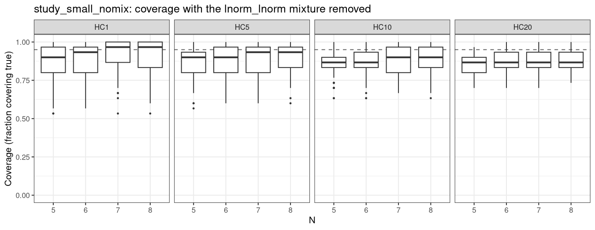

```{r setup}
library(knitr)
library(dplyr)
library(tidyr)
library(ggplot2)

# Reads the committed artifacts written by make_report_outputs.R (rerun that to
# refresh them from summary.parquet):
#   study_small_report_figure.png
#   study_small_summary_table.csv
# and the per-source summaries used in "The AICc mixture degeneracy":
#   source_weights_summary.csv, bias_by_source_summary.csv
# and the AICc forensics (built by aicc_degeneracy_reprex.R):
#   aicc_version_comparison.csv, aicc_fit_rate_comparison.csv
fig_path <- "study_small_report_figure.png"
tbl_path <- "study_small_summary_table.csv"
stopifnot(file.exists(fig_path), file.exists(tbl_path))

summary_table <- read.csv(tbl_path)

# HC1 (proportion 0.01) median relative bias at the sample sizes referenced inline
# in the Results prose, taken from the committed summary so the factors quoted there
# derive from provenance rather than being hardcoded.
hc1_bias <- summary_table[summary_table$proportion == 0.01, ]
hc1_bias_n5  <- hc1_bias$bias_median[hc1_bias$nrow == 5]
hc1_bias_n6  <- hc1_bias$bias_median[hc1_bias$nrow == 6]
hc1_bias_n10 <- hc1_bias$bias_median[hc1_bias$nrow == 10]
```

## Purpose and scope

This report asks a methodological question about species sensitivity distribution
(SSD) modelling: **how small a sample can support reliable HC~x~ estimation, and
how does the model-averaging criterion behave as the sample size approaches the
number of parameters being fitted?** It answers that question with a simulation
study — 41 datasets, seven sample sizes, and roughly 20,500 model fits — run
through the [`ssdsims`](https://poissonconsulting.github.io/ssdsims/) pipeline
[@ssdsims].

The study therefore has two aims that reinforce one another. The scientific aim is
to characterise the bias, interval width, and coverage of model-averaged HC~x~
estimates across sample sizes, and to establish what the AICc model-averaging
criterion does when the five-parameter mixture in the default candidate set is
fitted with too few observations. The methodological aim is to demonstrate a
simulation framework in which every figure and table traces back to committed
inputs, so that each result can be regenerated and inspected end to end. Both aims
are served by keeping the study small enough to be fully reproducible: 41
`ssddata` datasets rather than a large combined corpus.

The regulatory and scientific context for the sample-size question — the final
report of the Australia/New Zealand SSD investigation [@fox_final_2024], the 2024
addendum to that investigation [@fisher_addendum_2024], and the current ANZG
guidance [@warne_method_2025] — is set out in [Background]. This study revises one
finding from that earlier grey literature; that revision is discussed in a few
sentences in [Findings and recommendations] and is not the purpose of the report.

## Background

The final report of the joint investigation into SSD modelling and `ssdtools`
implementation for deriving toxicant guideline values in Australia and New Zealand
[@fox_final_2024] made a series of recommendations on the minimum sample sizes
required to fit the default candidate distributions. Two are directly relevant
here:

- **Recommendation #5 (minimum).** The minimum sample size should be 7 for the
  two-parameter distributions (gamma, log-Gumbel, lognormal, Weibull), 10 for
  three-parameter distributions (Burr III, not a default), and 16 for the
  five-parameter lognormal–lognormal mixture. Enforcing these in
  `ssd_fit_bcanz()` was noted to require technical-committee approval.
- **Recommendation #6 (preferred).** The *preferred* minimum sample size should be
  11 for the two-parameter distributions, 16 for three-parameter distributions,
  and 26 for the five-parameter mixture.

These recommendations bear directly on the sample-size minima in force. The ANZG
minimum at the time was 5 species [@warne_revised_2018; @anzg_2020]. The default
minimum in `ssdtools` v1.0 is 6 [@thorley_ssdtools_2018], consistent with the
British Columbia and Canadian derivation methodology [@bc_moe_2019]. The current
ANZG method sets the minimum at 6 species (preferably more) [@warne_method_2025].
A 2024 addendum to the joint investigation [@fisher_addendum_2024] — grey
literature prepared for a single agency — reported simulation studies designed to
inform a single default minimum across both the two-parameter unimodal
distributions and the five-parameter mixture, and recommended a single minimum of
$N = 6$.

The question of how HC~x~ estimation behaves at these small sample sizes, and of
how the model-averaging criterion treats an over-parameterised candidate near the
minimum, is the subject of the simulation study reported here.

## The `ssdsims` pipeline

`ssdsims` [@ssdsims] is an R package that expresses an SSD simulation study as a
[`targets`](https://docs.ropensci.org/targets/) dependency graph [@landau_targets_2021]:
sampling, distribution fitting, HC~x~ estimation, and summarisation are separate
targets whose inputs and outputs `targets` tracks, so a run is reproducible and
each artefact carries provenance back to the scenario that produced it. The same
graph runs unchanged on a single workstation or on an HPC — only the *controller*
changes.

For the run reported here that controller is a
[`crew.cluster`](https://wlandau.github.io/crew.cluster/) SLURM controller
[@crew_cluster]: each work "shard" is submitted as its own SLURM job while the
driver process runs on a login node. Sharding is coarsened so that each of the
sampling, distribution-fitting, and HC~x~ steps produces one shard per simulation
(all 41 datasets bundled together) — trading some parallelism for longer-lived
jobs that suit the scheduler. The companion `study_small_nomix` run
([Sensitivity to the candidate distribution set]) uses the *same* pipeline with a
`crew` local controller instead, illustrating the portability directly.

The pipeline provides three things this case study leans on: **reproducibility**
(the graph rebuilds from committed scenario definitions), **provenance** (every
figure and table below traces to a committed CSV extracted from the run store),
and **portability** (HPC and local execution from one definition). The concrete
HPC and local workflows are documented in [Appendix A — HPC workflow] and
[Appendix B — local WSL workflow].

## Methods

**Datasets.** All 41 example datasets in the `ssddata` package [@ssddata] were
used — 34 ANZG and 7 CCME. This differs from the 2024 addendum, which combined 20
`ssddata` datasets with the EnviroTox corpus of [@yanagihara_which_2024] for 353
datasets in total. This study replicates the addendum's *design* on the 41
`ssddata` datasets; it does not replicate the 353-dataset EnviroTox corpus. One
consequence is that some source distributions are represented by very few datasets
here (see **Source representation** below).

**Single-source generating design.** For each dataset, the top-AICc-weighted BCANZ
distribution from the real-data fit was treated as that dataset's single
data-generating "source" distribution, and samples were drawn from that one
distribution. The true HC~x~ for a dataset is the HC~x~ of that same source
distribution. Each simulated dataset therefore has a single true source, not a
mixture of sources [@fisher_addendum_2024].

**Source representation.** How cleanly each dataset represents a single BCANZ
distribution varies, and it governs how much weight the per-source panels in the
results can bear, so it is characterised here as part of the study design. The
per-dataset AICc weights are extracted from the cached real-data fits into
`dataset_aicc_weights.csv`.

```{r}
#| label: tbl-source-reps
#| tbl-cap: "For each BCANZ distribution: how many of the 41 datasets it is the top-weighted (source) distribution for, and the single dataset where it attains its highest AICc weight."
w <- read.csv("dataset_aicc_weights.csv")
dists_bcanz <- c("gamma", "lgumbel", "llogis", "lnorm", "lnorm_lnorm", "weibull")

wt_summary <- do.call(rbind, lapply(dists_bcanz, function(d) {
  i <- which.max(w[[d]])
  data.frame(
    Distribution = d,
    `Datasets sourced` = sum(w$source_dist == d),
    `Most representative dataset` = w$dataset[i],
    `Max AICc weight` = round(w[[d]][i], 3),
    check.names = FALSE
  )
}))
kable(wt_summary, align = "lrlr")

mix_i <- which.max(w$lnorm_lnorm)
mix_ds <- w$dataset[mix_i]; mix_wt <- w$lnorm_lnorm[mix_i]
uni <- setdiff(dists_bcanz, "lnorm_lnorm")
uni_max <- vapply(uni, function(d) max(w[[d]]), numeric(1))
```

Across the 41 `ssddata` datasets, only the **lnorm_lnorm mixture has a near-pure
representative** (`` `r mix_ds` ``, weight `r round(mix_wt, 2)`); for the five
unimodal distributions the best any single dataset reaches is only
`r round(min(uni_max), 2)`–`r round(max(uni_max), 2)`, so no `ssddata` dataset is
unambiguously one distribution. The counts of datasets per source are thin and vary
widely (gamma 4, lgumbel 15, llogis 5, lnorm 10, lnorm_lnorm 1, weibull 6), so the
`lnorm_lnorm`-source panel in the results is a single dataset (`anzg_iron_marine`)
and is not over-read. Finding clean, high-weight representatives of each source
distribution is exactly what motivated the addendum's use of a much larger corpus
[@fisher_addendum_2024]; this study trades that representativeness for full
reproducibility. The complete 41 × 6 weight matrix is in `dataset_aicc_weights.csv`.

**Estimation.** Every simulated dataset was re-fit with the model-averaged
("multi") method over the six BCANZ distributions, with 95% confidence intervals
from the recommended weighted-sample bootstrap [@fox_final_2024].

**Sample-size grid.** For every dataset, 500 samples of each size
$N \in \{5, 6, 7, 8, 10, 16, 26\}$ were drawn and re-fit. The grid follows the
addendum: 5 (current ANZG minimum), 6 (current BC/Canadian minimum), 7
(recommended new minimum), 8 (current ANZG preferred), 10 (recommended new
preferred), 16 (recommended five-parameter minimum), and 26 (recommended
five-parameter preferred).

**Metrics.** Three quantities are reported against $N$, for four HC~x~ proportions
(HC1, HC5, HC10, HC20):

- **Relative bias** — $(\widehat{\text{HC}}_x - \text{HC}_x)/\text{HC}_x$, where
  $\widehat{\text{HC}}_x$ is the estimate of the true value $\text{HC}_x$
- **Relative CI width** — $(\text{ucl} - \text{lcl})/\text{HC}_x$, where
  $\text{ucl}$ and $\text{lcl}$ are the upper and lower 95% confidence limits. The
  2024 addendum [@fisher_addendum_2024] refers to this same quantity as the scaled
  confidence interval width.
- **Coverage** — the fraction of simulations whose CI contained the true HC~x~

The terms "relative bias" and "relative CI width" and the limit symbols
$\text{ucl}$ / $\text{lcl}$ are used consistently throughout this report, including
in figure captions and axis labels.

## Results: bias, CI width, and coverage

Coverage of the true HC~x~ is lowest at $N = 5$, falling to 0.58 (HC1) through
0.78 (HC20) — well below the nominal 0.95. It rises to roughly 0.87–0.89 at
$N = 6$ and reaches about 0.93–0.94 by $N = 26$.

Confidence intervals are exceptionally wide at small $N$. The median relative CI width is about
41× the true HC1 value at $N = 5$, falling to roughly 3.9× at $N = 26$. Even at
$N = 26$ the high protection intervals (PC99/HC1) remain wide, reflecting that a small sample
cannot precisely estimate an extreme lower-tail quantiles.

```{r}
#| label: fig-main
#| fig-cap: "HC~x~ estimation versus sample size, faceted by HC proportion. Red boxes mark N ≤ 6. Relative bias is on a symmetric-log axis (it is signed, spanning −1 to ~10^8^); relative CI width is on a log10 axis; coverage is linear, with the dashed line at the nominal 0.95."
include_graphics(fig_path)
```

Bias is dominated by a heavy positive tail. Relative bias is bounded below at
$-1$, since an estimate cannot be negative, but is unbounded above, so it does
not treat over- and under-estimation symmetrically on a strictly positive
quantity: a tenfold overestimate scores $+9$, whereas a tenfold underestimate
scores only $-0.9$. The heavy positive tail, and the apparent change of sign
between $N = 5$ and $N = 6$, should be read on that scale — the median at
$N = 5$ corresponds to overestimation by a factor of
`r round(1 + hc1_bias_n5, 1)`, whereas the negative medians at $N = 6$–10
correspond to underestimation by factors of only
`r round(1 / (1 + hc1_bias_n6), 1)` to `r round(1 / (1 + hc1_bias_n10), 1)`.
The upper tail reaches order 10^8^ at the smallest
$N$ and lowest proportions (visible as the long whiskers in the top row of
@fig-main).

The non-monotonicity in both bias and coverage between $N = 5$ and $N = 6$ is a direct consequence of a
degeneracy in the AICc calculation for the `lnorm_lnorm` mixture distribution,
documented in detail in [The AICc mixture degeneracy] below. At $N = 5$, 95.5% of
the model-averaged HC estimates (78,272 of 82,000) collapse onto the `lnorm_lnorm`
mixture, which AICc erroneously weights as 1 when $n = k$, producing the large
positive bias; at $N = 6$ the mixture's AICc weight is forced to zero, every estimate
reverts to a unimodal average, and the bias changes sign. The non-monotonic recovery
is therefore an artefact of the AICc calculation switching regimes between $N = 5$
and $N = 6$, not a property of the estimator itself.

Across all three metrics, $N = 5$ performs very poorly and $N = 6$ is the point at
which behaviour becomes substantially more reliable. Much of this sharp
$N = 5$ / $N = 6$ split, however, is driven by the AICc mixture degeneracy rather
than by sample size itself: with the degenerate mixture removed, the gap narrows to
a gradual few percentage points (see [Sensitivity to the candidate distribution
set]).

```{r}
#| label: tbl-summary
#| tbl-cap: "Coverage, median relative bias (with interquartile range), and median relative CI width by HC proportion and sample size. Metric values are rounded to 3 significant figures."
display <- summary_table |>
  mutate(
    HC = paste0("HC", 100 * proportion),
    across(c(coverage, bias_median, bias_q25, bias_q75, width_median),
      \(x) signif(x, 3))
  ) |>
  select(HC, N = nrow, Sims = n_sims, Coverage = coverage,
    `Median bias` = bias_median, `Bias Q25` = bias_q25,
    `Bias Q75` = bias_q75, `Median CI width` = width_median)

kable(display, align = "lrrrrrrr")
```

## Results by source distribution

The aggregate metrics in [Results: bias, CI width, and coverage] average over all 41
datasets. Beyond bias, coverage, and interval width, it is informative to examine how
the AICc weights themselves behave as the sample size grows — whether the criterion
recovers the distribution that generated the data, and under what conditions the
five-parameter mixture attracts weight — and how the bias depends on which
distribution generated the data. This section reads the run by source distribution:
the BCANZ distribution treated, for each dataset, as its single data-generating
source (see [Methods]).

The two weight figures below track, for data generated from each source distribution,
how the re-fitted AICc weights change with $N$: @fig-4a the weight assigned to the
source distribution itself, @fig-4b the weight assigned to the `lnorm_lnorm` mixture.
Both are built from the committed `source_weights_summary.csv` (mean re-fitted AICc
weight per source × $N$ × distribution, averaged over the 500 simulations and over the
datasets sharing a source), and their per-dataset spread from `fit_weights_summary.csv`
and `fit_weights_quantiles.csv`. Panel headers carry the number of contributing
datasets so that thin panels — the `lnorm_lnorm` source, in particular, has only one —
are visible.

```{r per-source-setup}
sw <- read.csv("source_weights_summary.csv")
bs <- read.csv("bias_by_source_summary.csv")

# facet labels carry n_datasets so the thin panels (esp. lnorm_lnorm, 1 dataset)
# are honestly flagged in the plots themselves.
src_labs <- sw |>
  distinct(source_dist, n_datasets) |>
  transmute(source_dist, label = sprintf("%s (%d datasets)", source_dist, n_datasets))
src_labeller <- setNames(src_labs$label, src_labs$source_dist)
src_factor <- function(x) factor(x, levels = dists_bcanz)

# Per-dataset inputs for the variance-preserving 4A/4B figures. source_dist is
# joined from the committed dataset_aicc_weights.csv, whose full-precision argmax
# reproduces cache/true_hc.rds 41/41, so the figures render from a clean clone
# without the git-ignored per-sim inputs.
src_map <- read.csv("dataset_aicc_weights.csv")[, c("dataset", "source_dist")]

# One point per dataset per N: the mean re-fitted weight over the 500 sims
# (BETWEEN-DATASET variation), from the committed fit_weights_summary.csv.
wt_means <- read.csv("fit_weights_summary.csv") |>
  left_join(src_map, by = "dataset")

# q10-q90 of the weight ACROSS the 500 sims within each dataset (BETWEEN-SIMULATION
# variation), from the committed fit_weights_quantiles.csv (make_report_outputs.R).
wt_quant <- read.csv("fit_weights_quantiles.csv") |>
  left_join(src_map, by = "dataset")

# Stable horizontal offset per dataset within its source panel, so the same
# dataset holds the same x across N and its point + q10-q90 range align. Spread
# < 0.5 keeps N = 5 and N = 6 (the closest grid points) from overlapping.
dataset_offset <- src_map |>
  group_by(source_dist) |>
  mutate(off = (row_number() - (n() + 1) / 2) / pmax(n() - 1, 1) * 0.9) |>
  ungroup() |>
  select(dataset, off)

# Assemble a (point, range) layer for a chosen distribution column. `source`
# selects each dataset's own source distribution (4A); otherwise a fixed
# distribution such as the lnorm_lnorm mixture (4B).
weight_layers <- function(dist) {
  keep <- if (identical(dist, "source")) {
    \(d) d$distribution == d$source_dist
  } else {
    \(d) d$distribution == dist
  }
  pts <- wt_means[keep(wt_means), ] |>
    left_join(dataset_offset, by = "dataset") |>
    mutate(source_dist = src_factor(source_dist), x = nrow + off)
  rng <- wt_quant[keep(wt_quant), ] |>
    left_join(dataset_offset, by = "dataset") |>
    mutate(source_dist = src_factor(source_dist), x = nrow + off)
  list(pts = pts, rng = rng)
}

weight_plot <- function(dist, ylab) {
  L <- weight_layers(dist)
  ggplot() +
    geom_vline(xintercept = 7, linetype = 3, colour = "grey60") +
    geom_linerange(data = L$rng, aes(x, ymin = q10, ymax = q90),
      colour = "grey55", linewidth = 0.3) +
    geom_point(data = L$pts, aes(x, mean_weight), size = 0.7, alpha = 0.8) +
    facet_wrap(~source_dist, labeller = as_labeller(src_labeller)) +
    scale_x_continuous(breaks = sort(unique(wt_means$nrow))) +
    scale_y_continuous(limits = c(0, 1)) +
    labs(x = "N (sample size)", y = ylab) +
    theme_bw(base_size = 10)
}

# Numbers referenced in the prose below (all from the committed CSVs).
mix5 <- sw |>
  filter(distribution == "lnorm_lnorm", nrow == 5) |>
  summarise(m = weighted.mean(mean_weight, n_datasets)) |> pull(m)
mix5_uni <- sw |>
  filter(distribution == "lnorm_lnorm", nrow == 5, source_dist != "lnorm_lnorm") |>
  summarise(m = weighted.mean(mean_weight, n_datasets)) |> pull(m)

# N = 5 spread of the mixture weight, for the prose: every dataset's median is
# exactly 1, and only one dataset shows any simulation spread (q10 < 0.99).
mix_q5 <- wt_quant |> filter(distribution == "lnorm_lnorm", nrow == 5)
mix5_all_med1 <- all(abs(mix_q5$q50 - 1) < 1e-6)
mix5_n_spread <- sum(mix_q5$q10 < 0.99)
```

```{r}
#| label: fig-4a
#| fig-cap: "Re-fitted AICc weight of the source distribution versus N, one panel per source distribution. Each point is one dataset's mean weight over its 500 simulations (between-dataset spread); each grey line is that dataset's 10th–90th percentile across those simulations (between-simulation spread). From N ≥ 7 (dashed line) the weight on the source distribution rises with N, as more observations let the criterion discriminate the generating distribution from its competitors. The near-zero source weight at N = 5 and the shift at N = 6 in the unimodal panels are explained in [The AICc mixture degeneracy]."
#| fig-width: 8
#| fig-height: 5
weight_plot("source", "Re-fitted AICc weight\nof the source distribution")
```

At $N \ge 7$ — the dashed line, where the mixture's AICc becomes valid — @fig-4a reads
the way model averaging should. The weight on the source distribution rises with $N$:
at small $N$ a handful of observations cannot distinguish one candidate distribution
from another, so the weight is spread diffusely across the candidates, and it
concentrates on the generating distribution only as the sample grows. Recovery is
incomplete even at $N = 26$, because model averaging over six candidates spreads
weight and the real-data weights are themselves diffuse ([Source representation]).

```{r}
#| label: fig-4b
#| fig-cap: "Re-fitted AICc weight of the lnorm_lnorm mixture versus N, faceted by source distribution. Each point is one dataset's mean weight over its 500 simulations; each grey line is that dataset's 10th–90th simulation percentile. From N = 7 (dashed line) the mixture earns appreciable weight only where the source data are genuinely bimodal and the sample is large enough to detect it. At N = 5 every point sits at ≈ 1 in every panel — including all five unimodal sources, which generated no mixture data — and the weight drops to exactly 0 at N = 6; this N = 5–6 behaviour is explained in [The AICc mixture degeneracy]."
#| fig-width: 8
#| fig-height: 5
weight_plot("lnorm_lnorm", "Re-fitted AICc weight\nof the lnorm_lnorm mixture")
```

@fig-4b shows the complementary reading for the mixture. From $N \ge 7$, where it is
properly penalised, a non-trivial mixture weight requires both genuine bimodality in
the source data and a sample large enough to detect it. Only `anzg_iron_marine` — the
sole bimodal source among the 41 ([Source representation]) — attracts appreciable
mixture weight, and only at larger $N$; the five unimodal sources stay near zero. This
is the expected and correct behaviour of the criterion: the mixture is a legitimate
competitor under exactly those conditions.

Bias also varies with the generating distribution. @fig-3 shows the median relative
bias by source:

```{r}
#| label: fig-3
#| fig-cap: "Median relative bias versus N, faceted by source distribution, coloured by HC proportion. The line and points are the median; the shaded band is the Q25–Q75 spread across datasets and simulations, from the committed bias_by_source_summary.csv. Bias is on a symmetric-log axis (signed, with a heavy positive tail at small N). Bias is largest by far at N = 5 for gamma-sourced data, whose extreme left tail is where over-prediction of the low HC~x~ quantiles is most severe; the anomalous N = 5–6 behaviour is explained in [The AICc mixture degeneracy]."
#| fig-width: 8
#| fig-height: 5.5
props <- sort(unique(bs$proportion))
fig3 <- bs |>
  mutate(
    source_dist = src_factor(source_dist),
    HC = factor(paste0("HC", 100 * proportion),
      levels = paste0("HC", 100 * props))
  )

ggplot(fig3, aes(nrow, bias_median, colour = HC, fill = HC)) +
  geom_hline(yintercept = 0, linewidth = 0.3, colour = "grey40") +
  geom_vline(xintercept = 7, linetype = 3, colour = "grey60") +
  # Q25-Q75 band (dataset + simulation spread) beneath the median line.
  geom_ribbon(aes(ymin = bias_q25, ymax = bias_q75),
    alpha = 0.12, colour = NA) +
  geom_line() +
  geom_point(size = 1.2) +
  facet_wrap(~source_dist, labeller = as_labeller(src_labeller)) +
  scale_x_continuous(breaks = sort(unique(bs$nrow))) +
  scale_y_continuous(
    trans = scales::pseudo_log_trans(sigma = 1, base = 10),
    breaks = c(-1, 0, 1, 10, 100),
    labels = scales::label_number(scale_cut = scales::cut_short_scale())
  ) +
  scale_colour_viridis_d(option = "C", end = 0.85) +
  scale_fill_viridis_d(option = "C", end = 0.85) +
  labs(x = "N (sample size)", y = "Median relative bias\n(est − true)/true") +
  theme_bw(base_size = 10)
```

Bias is largest by far at $N = 5$ for gamma-sourced data. The gamma's extreme left tail
is where over-prediction of the low HC~x~ quantiles bites hardest, so gamma-sourced
data carry the heaviest positive bias; the other unimodal sources show the same sign at
$N = 5$ but a smaller magnitude. From $N \ge 7$ the bias settles toward zero across all
sources as $N$ grows.

### The N = 5 and N = 6 anomaly

At $N = 5$ and $N = 6$ the weights in all three figures depart sharply from the
pattern above, and identically across panels regardless of what generated the data. At
$N = 5$ the `lnorm_lnorm` mixture takes essentially all the weight in every panel of
@fig-4b — including the five unimodal sources, which generated no mixture data — so the
weight on the source distribution in @fig-4a collapses to near zero and the bias in
@fig-3 jumps to its largest positive values. At $N = 6$ the mixture takes exactly none
of the weight, again in every panel, and the source-distribution weight and bias shift
accordingly. That this is the same in panels whose source never produced a mixture
means it is not a property of the data: it is an artefact of the AICc criterion,
explained in the next section, [The AICc mixture degeneracy].

## The AICc mixture degeneracy

The small-$N$ behaviour in the results above is driven by a degeneracy in the AICc
model-averaging criterion, which this study surfaces across all 41 datasets and
20,500 fits. This section sets out the mechanism, draws on the per-source figures
(@fig-4a, @fig-4b, @fig-3) to show that the degeneracy is a property of the criterion
rather than of the data, and reports one result from the earlier grey literature that
cannot be reconciled with this run. A comparison establishing that the degeneracy is
invariant to `ssdtools` version and to the fit arguments is given in
[Appendix D — AICc degeneracy: version and fitting-engine comparison].

### The mechanism

At small $N$ the AICc small-sample correction breaks down for the five-parameter
mixture, and this is what the criterion is doing rather than the mixture fitting
better. AICc adds $\frac{2k(k+1)}{n-k-1}$ to AIC, and for the five-parameter
mixture ($k = 5$) that denominator is non-positive at small $N$. At $n = 5$ it is
$-1$, so the correction is $2\cdot5\cdot6/(-1) = -60$ and the mixture's AICc is
spuriously *lowered* — a reward rather than a penalty — so it wins every comparison
and takes weight $\approx 1$. At $n = 6$ the denominator is $0$, its AICc is
$+\infty$, and its weight is forced to exactly 0. The correction is only defined
for $n \ge k + 2$, i.e. $N \ge 7$ for a five-parameter model, so the $N = 5$
and $N = 6$ mixture weights are degenerate artefacts of the criterion, not evidence
about fit.

This is reproducible in a few lines against current CRAN `ssdtools`, and is
recorded as a `ssdtools` software issue [@ssdtools_aicc_issue]:

```r
library(ssdtools)                                     # 2.6.0
dat <- data.frame(Conc = c(0.1, 0.3, 1, 3, 10))       # n = 5
fit <- ssd_fit_dists(dat, dists = ssd_dists_bcanz(), nrow = 5)
glance(fit, wt = TRUE)[, c("dist", "npars", "aic", "aicc", "wt")]
#> dist        npars   aic   aicc   wt
#> gamma           2  23.3   29.3   ~0
#> lgumbel         2  23.1   29.1   ~0
#> llogis          2  23.3   29.3   ~0
#> lnorm           2  22.9   28.9   ~0
#> lnorm_lnorm     5  28.0  -32.0   1.00   # worst AIC, best AICc: correction = -60
#> weibull         2  23.2   29.2   ~0
```

The mixture has the worst AIC (28.0) but the best AICc (−32.0), and so takes
essentially all of the AICc weight. These values are fixed by the criterion alone:
each two-parameter candidate receives a correction of $2\cdot2\cdot3/(5-2-1) = +6$
and the mixture a correction of $2\cdot5\cdot6/(5-5-1) = -60$, a 66-point swing
computed entirely from the integers $n$ and $k$ and set against AIC differences
that, on five observations, are of order $0.1$. Neither the $-60$ at $n = 5$ nor the
$+\infty$ at $n = 6$ depends on the log-likelihood, the optimiser, or the data — the
ranking is settled before the data are consulted. This is why relaxing `computable`,
`at_boundary_ok` or `min_pmix` changes nothing, and why the mixture weight is
identical across every `ssdtools` version tested
([Appendix D — AICc degeneracy: version and fitting-engine comparison]).

### The degeneracy is mechanical, not data-dependent

The single-dataset reprex above generalises to all 41 datasets, and the per-source
weight figure ([Results by source distribution]) is the most direct evidence. At
$N = 5$ the mixture receives a mean re-fitted weight of `r round(mix5, 2)` across all
41 datasets (`r round(mix5_uni, 2)` averaged over just the five unimodal sources),
regardless of what generated the data (@fig-4b). The spread behind that mean is what
makes the case: the median re-fitted mixture weight at $N = 5$ is exactly $1$ for
`r if (mix5_all_med1) "every one of the 41 datasets" else "almost every dataset"`, and
for `r 41 - mix5_n_spread` of them the entire 10th-to-90th-percentile band across the
500 simulations sits at $\ge 0.99$ — both the between-dataset and the
between-simulation spread are negligible. The single exception is `anzg_iron_marine`
(the lone `lnorm_lnorm` source), whose mixture genuinely competes; its panel is the
only one showing a visible range at $N = 5$. The mean is pulled below $1$ (to
`r round(mix5, 2)`) only by a thin tail of simulations in which the mixture fit failed
numerically and took weight $0$ — not by any real spread in the weight the criterion
assigns. A weight of $\approx 1$ with this little variation, across every dataset and
almost every simulation and irrespective of what generated the data, is the strongest
available demonstration that the degeneracy is mechanical, a property of the criterion
at $n = k$, rather than data-dependent evidence of bimodality. It is the like-for-like
complement to the criterion-not-fit argument in [Findings and recommendations]. The
five unimodal panels of @fig-4b carry this argument; the `lnorm_lnorm`-source panel is
a single dataset and is shown only for completeness.

### An irrecoverable result

A long-standing degeneracy in the AICc small-sample correction becomes dominant
under the current `ssdtools` fitting engine. At $N = 5$ the engine fits the
over-parameterised mixture in essentially every case: across the 41 real datasets
the mean re-fitted mixture weight is `r round(mix5, 2)`, and 95.5% of the $N = 5$
model-averaged HC estimates collapse onto it (@fig-4b; [Results: bias, CI width,
and coverage]). These two figures — the mean re-fitted mixture weight and the
fraction of estimates that collapse onto the mixture — coincide because at $N = 5$
the mixture's weight is effectively binary: near $0$ when the fit fails and near $1$
when it succeeds and takes the $-60$ reward. The mean weight is therefore
essentially the fit-success rate itself, and the degeneracy operates as a hard
switch rather than a gradient.

This is a change in the fitting engine, not the criterion. The AICc formula and its
degeneracy are byte-identical across the `ssdtools` versions tested
[@ssdtools_aicc_issue]; what moved between the 1.0.x and 2.x series is how often the
over-parameterised mixture is actually *fitted* at $N = 5$.

```{r fit-rate-scalars}
# Headline fit rates for the prose; the full comparison table is in Appendix D.
fr <- read.csv("aicc_fit_rate_comparison.csv")
fr_get <- function(v, p, col) fr[[col]][fr$version == v & fr$profile == p]
rate_old <- fr_get("1.0.6", "native", "pct_mixture_present")
wt_old   <- fr_get("1.0.6", "native", "mean_mixture_weight")
rate_new <- fr_get("2.6.0", "native", "pct_mixture_present")
wt_new   <- fr_get("2.6.0", "native", "mean_mixture_weight")
```

A Monte Carlo check — 1,000 samples of $N = 5$ drawn from a unimodal lognormal
source and fitted under each engine — isolates that shift. Under the 2024-era engine
(`ssdtools` 1.0.6) the mixture is fitted at $N = 5$ in about `r round(rate_old)`% of
samples, with mean weight `r round(wt_old, 2)`; under the current engine (2.6.0, the
pipeline's own settings) it is fitted in nearly every case (`r round(rate_new)`%,
mean weight `r round(wt_new, 2)`). The mean weight tracks the fit rate directly,
because a fitted $N = 5$ mixture almost always wins the $-60$ AICc reward. The
pre-existing degeneracy therefore went from intermittent to near-universal because
the fitting engine became more capable of fitting an over-parameterised model, not
because the criterion changed. The full version-and-engine comparison — with
confidence intervals and a lenient-settings control — is reported in
[Appendix D — AICc degeneracy: version and fitting-engine comparison]
(@tbl-aicc-version, @tbl-fit-rate).

This is where reproducibility, rather than any particular software version, becomes
the point. An earlier weights figure from the grey-literature study of this same
question [@fisher_addendum_2024] shows the `lnorm_lnorm` mixture near zero for
unimodal sources at these sample sizes — behaviour the criterion cannot produce while
the mixture is in the candidate set, because the arithmetic above forces its weight
to $\approx 1$ at $N = 5$ and to exactly $0$ at $N = 6$ irrespective of the data.
Reconciling the two would require re-running that earlier analysis, but its
simulation code is unavailable and cannot be recovered, so whether the discrepancy
reflects a fitting engine that rarely fitted the mixture, a candidate set that
excluded it, the sample sizes at which it was evaluated, or some combination cannot
be determined. The discrepancy is reported here as unresolved.

That irrecoverability is itself the argument for a pipeline in which every figure
and table traces back to committed inputs. It is not a claim that this study "caught
a bug" an earlier one missed — that is not supportable — nor a claim of a defect in
the earlier work; the point is infrastructural, that a result which cannot be
regenerated cannot be diagnosed whichever way the discrepancy would have resolved.
The same principle caught a smaller slip in this study's own metadata:
`ccme_boron`'s source was first recorded as `gamma` from an argmax over
three-decimal AICc weights, where gamma and weibull both display as 0.357, when at
full precision weibull (0.357472) narrowly wins and is what the pipeline actually
sampled — a rounding-then-argmax error, corrected once identified and catchable only
because the run and its metadata were both inspectable.

### Practical implications

Two practical implications follow. First, an AICc-weighted candidate set should not
include a distribution with $k \ge N - 1$ parameters — for the five-parameter
mixture that means excluding it below $N = 7$ — or the weights are meaningless; a
fix at the criterion level (returning `AICc = Inf` when `nobs < npars + 2`) is
proposed in the `ssdtools` issue [@ssdtools_aicc_issue]. Second, this degeneracy is
one concrete mechanism behind the poor $N = 5$ behaviour in the main results:
at $N = 5$ the model-averaged estimate is dominated by a mixture the criterion has
erroneously rewarded. The next section isolates how much of the $N = 5$ failure is
this artefact and how much is the sample size itself.

## Sensitivity to the candidate distribution set

The degeneracy above raises the question of how much of the $N = 5$ failure is the
estimator running out of data and how much is the criterion rewarding a
five-parameter mixture it should have excluded at that $N$. This cannot be
recovered from the run above — coverage and CI width need fresh bootstrap
intervals computed from the reduced candidate set — so it needs its own run. The
companion [`study_small_nomix`](../study_small_nomix) pipeline repeats the design on all 41
datasets with the five 2-parameter unimodal distributions only (gamma,
lgumbel, llogis, lnorm, weibull — for which AICc is well defined at $N \ge 4$),
at `nsim = 30`, $N \in \{5, 6, 7, 8\}$, `nboot = 200`. It runs locally in
~30 min (`../study_small_nomix/README.md`); its committed summary feeds
@tbl-nomix and @fig-nomix below.

```{r}
#| label: tbl-nomix
#| tbl-cap: "Coverage of the true HC~x~ by sample size with the lnorm_lnorm mixture removed (five 2-parameter distributions only; 41 datasets × 30 sims = 1,230 per cell)."
nomix <- read.csv("../study_small_nomix/study_small_nomix_summary_table.csv")

cov_wide <- nomix |>
  mutate(HC = paste0("HC", 100 * proportion)) |>
  select(HC, nrow, coverage) |>
  pivot_wider(names_from = nrow, values_from = coverage,
    names_prefix = "N=") |>
  mutate(across(starts_with("N="), \(x) signif(x, 3)))
kable(cov_wide, align = "lrrrr")

# Gap between N=5 and N=6 with the mixture gone, for the prose below.
gap56 <- nomix |>
  select(proportion, nrow, coverage) |>
  pivot_wider(names_from = nrow, values_from = coverage) |>
  mutate(gap = `6` - `5`)
mean_gap_pts <- round(100 * mean(gap56$gap), 1)
n5_min <- signif(min(nomix$coverage[nomix$nrow == 5]), 3)
n5_max <- signif(max(nomix$coverage[nomix$nrow == 5]), 3)
w5 <- signif(nomix$median_width[nomix$nrow == 5 & nomix$proportion == 0.01], 3)
w6 <- signif(nomix$median_width[nomix$nrow == 6 & nomix$proportion == 0.01], 3)
```

```{r}
#| label: fig-nomix
#| fig-cap: "Per-dataset coverage by N with the lnorm_lnorm mixture removed. Boxes overlap heavily across N = 5–8 with no step at N = 5→6; the dashed line is the nominal 0.95."

```

With the degenerate component removed, $N = 5$ coverage is `r n5_min`–`r n5_max`
across the four proportions, compared with the 0.58–0.78 seen with the full BCANZ
set, and moving from $N = 5$ to $N = 6$ adds only about `r mean_gap_pts` percentage
points of coverage on average, with a smooth, monotonic rise through $N = 8$ rather
than a step. The sharp $N = 5$-versus-$N = 6$ discontinuity in the main results
was therefore substantially a consequence of the AICc criterion switching regimes
(mixture weight $\approx 1$ at $N = 5$, forced to 0 at $N = 6$), not an intrinsic
property of HC~x~ estimation at $N = 5$.

Two limitations qualify this result. First, every cell still under-covers
(~0.85–0.90 against the nominal 0.95, even at $N = 8$) — a separate small-sample
limitation of the `weighted_samples` bootstrap that removing the mixture does not
eliminate. Second, $N = 5$ remains the least precise case: its median relative CI
width at HC1 is `r w5` versus `r w6` at $N = 6$, so smaller samples still pay in
interval width, and in most cases in bias, even when coverage is close. The
practical conclusion is therefore narrower than "$N = 5$ is a distinct failure
regime": once a candidate set with no $k \ge N - 1$ distribution is used, $N = 5$ is
worse than $N = 6$ only gradually, not catastrophically.

One caveat on comparability: `anzg_iron_marine`'s generating distribution differs
between the two runs (lnorm_lnorm in the full BCANZ run, lgumbel here), because the
mixture-excluded run re-selects each dataset's source from the reduced
five-distribution set.

## Findings and recommendations

```{r sec8-setup}
# Marginal value of an additional species, from the committed full-BCANZ summary.
# Coverage and relative CI width are averaged over the four HC proportions at each N,
# then differenced across the N grid and divided by the gap (dN) to put every step on
# a per-species footing (the grid is uneven: 5,6,7,8,10,16,26).
marg_tbl <- summary_table |>
  group_by(nrow) |>
  summarise(coverage = mean(coverage), width = mean(width_median), .groups = "drop") |>
  arrange(nrow) |>
  mutate(
    dN = nrow - lag(nrow),
    cov_gain_per_sp  = (coverage - lag(coverage)) / dN,
    width_pct_per_sp = 100 * (width / lag(width) - 1) / dN
  )

# Scalars for the prose (all inline; no hardcoded quantities).
gain_pts <- function(N) 100 * marg_tbl$cov_gain_per_sp[marg_tbl$nrow == N]
cov_cell_max   <- signif(max(summary_table$coverage), 3)
cov_cell_max_N <- summary_table$nrow[which.max(summary_table$coverage)]
cov_mean_max   <- signif(max(marg_tbl$coverage), 3)
cov_mean_max_N <- marg_tbl$nrow[which.max(marg_tbl$coverage)]
```

### The AICc small-sample degeneracy

The general rule is that the AICc small-sample correction is only defined for
$n \ge k + 2$: any candidate distribution with $k \ge n - 1$ parameters is fitted
with too few observations for the correction to be meaningful, and the weight it
receives is an artefact of the criterion rather than evidence about fit. For the
five-parameter `lnorm_lnorm` mixture ($k = 5$) this means its AICc weight is
degenerate at both $N = 5$ and $N = 6$. At $N = 5$ ($n = k$) the correction is
negative and the mixture is rewarded — its mean re-fitted weight across the 41
datasets is `r round(mix5, 2)`, essentially $1$. At $N = 6$ ($n = k + 1$) the
correction's denominator is zero, its AICc is $+\infty$, and its weight is forced to
exactly $0$. Only from $N \ge 7$ is the mixture's AICc finite and properly
penalising, and only then is its weight meaningful.

### The consequence at the current guideline minimum

The most directly useful finding for the technical committee is what this does at
the guideline minimum. At $N = 6$ — the minimum specified by @warne_method_2025 —
the `lnorm_lnorm` mixture is present in the BCANZ candidate set, is fitted, appears
in the `glance()` output, and contributes exactly zero weight, with no warning.
A genuinely bimodal dataset therefore cannot be identified as bimodal at the
guideline minimum sample size, however bimodal it is: the one candidate that could
represent bimodality is arithmetically excluded before the data are consulted. The
zero is harmless in the sense that it does not distort the model average — but it is
not a considered exclusion. It is a division by zero that happens to land in a safe
place, and it would land there whether or not the mixture was the right description
of the data.

### Implications for the minimum sample size

The value of an additional species diminishes quickly once the criterion artefact
is set aside. @tbl-marginal reports, for the full BCANZ run, the mean coverage and
mean relative CI width at each $N$, and the marginal change per additional species
across the (uneven) grid.

```{r}
#| label: tbl-marginal
#| tbl-cap: "Marginal value of an additional species in the full BCANZ run. Coverage and relative CI width are averaged over the four HC proportions at each N; the per-species columns divide the change from the previous grid point by the number of species added. The full-BCANZ 5→6 coverage gain is inflated by the AICc mixture degeneracy; the adjacent mixture-removed column (from the study_small_nomix run, N ∈ {5, 6, 7, 8}) gives the same per-species steps with the degenerate component excluded."
fmt_gain <- function(g) dplyr::case_when(
  is.na(g) ~ "—",
  abs(100 * g) < 0.1 ~ sprintf("%+.2f pts", 100 * g),
  TRUE ~ sprintf("%+.1f pts", 100 * g))

# Same per-species coverage gain with the lnorm_lnorm mixture removed
# (study_small_nomix; N in {5,6,7,8}), aligned to the full-BCANZ grid so the
# inflated 5->6 step can be read against its mixture-free counterpart.
nomix_gain <- nomix |>
  group_by(nrow) |>
  summarise(coverage = mean(coverage), .groups = "drop") |>
  arrange(nrow) |>
  mutate(cov_gain_per_sp = (coverage - lag(coverage)) / (nrow - lag(nrow)))
nomix_gain <- setNames(nomix_gain$cov_gain_per_sp, nomix_gain$nrow)

marg_tbl |>
  transmute(
    N = nrow,
    `Mean coverage` = signif(coverage, 3),
    `Coverage gain / species` = fmt_gain(cov_gain_per_sp),
    `Coverage gain / species (mixture removed)` = vapply(nrow, function(n) {
      g <- nomix_gain[as.character(n)]
      if (length(g) == 0 || is.na(g)) "—" else fmt_gain(g)
    }, character(1)),
    `Mean rel. CI width` = signif(width, 3),
    `CI width / species` = ifelse(is.na(width_pct_per_sp), "—",
      sprintf("%.1f%%", width_pct_per_sp))
  ) |>
  kable(align = "rrrrrr")
```

Three points follow from @tbl-marginal, none of which supports raising the minimum.

First, the sharp $N = 5 \to N = 6$ step is substantially an artefact of the
criterion, not of sample size. In the full run the coverage gain from $N = 5$ to
$N = 6$ is `r sprintf("%+.1f", gain_pts(6))` percentage points per species — the
largest step in @tbl-marginal — but this is the mixture weight collapsing from
$\approx 1$ to $0$, not the estimator suddenly using the sixth species well. With
the mixture removed ([Sensitivity to the candidate distribution set]) the same step
adds only about `r mean_gap_pts` percentage points per species, comparable to the
`r sprintf("%+.1f", gain_pts(7))`-point $N = 6 \to N = 7$ step, and the rise through
$N = 8$ is smooth rather than a step. The evidence that appeared to support a step
change at the minimum therefore does not support that interpretation.

Second, returns diminish and there is no distinct jump anywhere on the grid.
Beyond $N = 8$ the per-species coverage gain is under one point
(`r sprintf("%+.1f", gain_pts(10))` pts at $8 \to 10$, `r sprintf("%+.1f", gain_pts(16))`
at $10 \to 16$, and a negligible `r sprintf("%+.2f", gain_pts(26))` — under a tenth of
a point — at $16 \to 26$), and the relative-CI-width reduction per species shrinks in
step. This reproduces the 2024
addendum's own conclusion — that there were "no distinct jumps … no clear criteria
with which to set the preferred minimum" [@fisher_addendum_2024]. Reaching the same
null result from an independent, fully reproducible run is itself a finding, not a
failure to find one.

Third, coverage never reaches the nominal $0.95$ at any $N$ tested, including
$N = 26$ (the highest per-cell coverage anywhere in the run is `r cov_cell_max`,
at $N = `r cov_cell_max_N`$; the highest mean over the four proportions is
`r cov_mean_max` at $N = `r cov_mean_max_N`$). This residual under-coverage persists
to the largest sample size and is a property of the weighted-sample bootstrap, not
of sample size — increasing $N$ does not remove it, so it cannot be the basis for a
higher minimum either. The mixture-excluded run spans only
$N \in \{5, 6, 7, 8\}$ and so cannot speak to the larger grid, but over the range it
does cover it tells the same story: every cell under-covers, and the improvement
from $N = 5$ is gradual.

Taken together, the data support no change to the minimum sample size. The $N = 6$
minimum of @warne_method_2025 remains supportable — nothing here argues for lowering
it, and $N = 5$ remains the least precise case in interval width — while the smooth,
always-under-covering behaviour above $N = 6$ gives no threshold at which to set a
higher one. Because each additional species is an additional toxicity test, a
recommendation to raise the minimum would need positive evidence of a threshold, and
these results do not provide one.

### Relation to the 2024 addendum

These results revise one finding of the 2024 addendum [@fisher_addendum_2024] in
three specifics. First, the sharp $N = 5$-versus-$N = 6$ coverage step that helped
support its $N = 6$ recommendation is substantially an artefact of the AICc mixture
degeneracy, not of sample size (@tbl-marginal; [Sensitivity to the candidate
distribution set]). Second, the $N = 6$ recommendation itself remains supportable on
the grounds above, so this is a revision of the supporting evidence, not of the
conclusion. Third, the addendum's own weights figure cannot be reconstructed from the
available materials and so cannot be reconciled with this run (see [An irrecoverable
result]) — a reproducibility limitation of the earlier grey literature rather than a
defect in its recommendation.

### Recommendations to `ssdtools`

The concrete fix belongs at the criterion level. `ssdtools` should apply a
**per-distribution AICc guard**: when `nobs < npars + 2`, return `AICc = Inf` (or
`NA`) for that distribution rather than evaluating the raw correction formula, so an
unidentifiable distribution can never receive a finite — let alone a rewarded —
AICc weight. It could optionally emit a message noting the distribution was dropped
for insufficient data. This is the fix proposed in the filed `ssdtools` issue
[@ssdtools_aicc_issue], and it would make $N = 5$ behave for the mixture the way
$N = 6$ already does (weight $0$, effectively excluded) instead of rewarding it.

The existing global `nrow >= 6` guard in `ssd_fit_dists()` is too coarse to serve as
a substitute. It does not prevent the degeneracy at the $N = 6$ it permits —
the mixture's AICc is still $+\infty$ there — and any workflow that lowers `nrow`,
including simulation studies such as this one, immediately re-exposes the $N = 5$
reward. A per-distribution guard fixes the mechanism wherever it would otherwise
arise; the global row check only hides one instance of it.

## Appendix A — HPC workflow



## Appendix B — local WSL workflow



## Appendix C — reproducing the run diagnostics

Build times are computed from a per-shard extract of the run's `targets`
metadata store (`run_diagnostics.csv`, committed alongside this report). See
[Reproducing these diagnostics] for exactly how that file was pulled from the
HPC.

```{r}
#| label: tbl-diagnostics
#| tbl-cap: "Per-step build diagnostics computed from the run's targets metadata."
diag <- read.csv("run_diagnostics.csv")

# Reference specs for the WSL workstation this report compares against, and the
# run's SLURM sizing (the hc workers failed at 2 GB and ran at 8 GB).
wsl_cores   <- 22L
wsl_ram_gb  <- 31
hc_shard_gb <- 8
hpc_workers <- 120L

step_order <- c("sample", "fit", "hc", "summary", "barrier")
fmt_time <- function(h) ifelse(h < 1 / 60, "<0.1 min",
  ifelse(h < 1, paste0(round(h * 60, 1), " min"), paste0(round(h, 1), " h")))

by_step <- diag |>
  dplyr::group_by(step) |>
  dplyr::summarise(
    shards  = dplyr::n(),
    total_h = sum(seconds, na.rm = TRUE) / 3600,
    mean_h  = mean(seconds, na.rm = TRUE) / 3600,
    max_h   = suppressWarnings(max(seconds, na.rm = TRUE)) / 3600,
    gb      = sum(bytes, na.rm = TRUE) / 1e9,
    .groups = "drop"
  ) |>
  dplyr::mutate(step = factor(step, step_order)) |>
  dplyr::arrange(step)

# Scalars reused in the prose/estimates below.
total_h    <- sum(diag$seconds, na.rm = TRUE) / 3600
total_gb   <- sum(diag$bytes, na.rm = TRUE) / 1e9
n_targets  <- nrow(diag)
i_long     <- which.max(diag$seconds)
long_name  <- diag$name[i_long]
long_h     <- diag$seconds[i_long] / 3600
get <- function(s, col) by_step[[col]][by_step$step == s]
hc_h <- get("hc", "total_h"); hc_n <- get("hc", "shards")
fit_h <- get("fit", "total_h"); fit_gb <- get("fit", "gb")

serial_days <- total_h / 24
ideal_h     <- total_h / wsl_cores
ram_conc    <- floor(wsl_ram_gb / hc_shard_gb) # hc shards that fit in RAM at once
ram_days    <- total_h / ram_conc / 24
hpc_ideal_h <- total_h / hpc_workers

by_step |>
  dplyr::transmute(
    Step = as.character(step),
    Shards = format(shards, big.mark = ","),
    `Total compute` = fmt_time(total_h),
    `Mean / shard` = fmt_time(mean_h),
    `Longest shard` = fmt_time(max_h),
    Output = paste0(round(gb, 2), " GB")
  ) |>
  kable(align = "lrrrrr")
```

The pipeline comprised `r format(n_targets, big.mark = ",")` targets
(@tbl-diagnostics). The
HC~x~ bootstrap dominates: `r hc_n` shards, ~`r round(hc_h)` core-hours in total,
the longest (`` `r long_name` ``) taking `r round(long_h, 1)` h. Distribution
fitting adds only ~`r round(fit_h)` core-hours but ~`r round(fit_gb)` GB of the
`r round(total_gb, 1)` GB of output (fitted `fitdists` objects are large); the
sampling and summary steps are negligible in both time and size. The total
serial compute is ~`r format(round(total_h), big.mark = ",")` core-hours
(≈ `r round(serial_days)` core-days).

Spread across the pool of up to `r hpc_workers` SLURM workers, that is
~`r round(hpc_ideal_h, 1)` h of *ideal* wall time — consistent with the ~7 h
observed for the final (post-fix) run. Worker jobs requested 1 CPU and 8 GB RAM on
the `cpuq` partition, with a 12-hour wall limit; the 8 GB was necessary, as the
HC~x~ workers were killed for exceeding memory at 2 GB. Fitting used R 4.4.1 with
`ssdsims`/`ssdtools`, results were written as local Parquet, and the figures and
tables in this report were produced afterwards on the WSL workstation.

### What this would cost on the WSL workstation

The same workload on the WSL machine (`r wsl_cores` cores, `r wsl_ram_gb` GB
RAM), assuming comparable per-core speed:

| Scenario | Estimated wall time |
|---|---|
| Single core (serial) | ~`r format(round(total_h), big.mark = ",")` h ≈ **`r round(serial_days)` days** |
| All `r wsl_cores` cores, *if* memory allowed | ~`r round(ideal_h)` h ≈ **`r round(ideal_h / 24, 1)` days** |
| Realistic (memory-bound) | ~`r round(ram_days)` days (**~`r round(ram_days / 7, 1)` weeks**) |

The all-cores figure is not achievable here: each HC~x~ shard needs several GB of
RAM, so `r wsl_ram_gb` GB caps concurrency at ~`r ram_conc` shards, not
`r wsl_cores` — the run would be bound by memory, not cores. (If the true peak is
below the 8 GB requested, more shards fit and the figure shrinks toward a week.)
The HPC's parallelism and per-node memory reduced a multi-week single-workstation
job to roughly eight hours of wall time.

### Reproducing these diagnostics

`run_diagnostics.csv` is a per-shard extract of the HPC run's `targets` metadata.
To regenerate it, pull the metadata file from the HPC (read-only; from WSL):

```sh
REMOTE=/export/home/q-z/rfisher/ssdtools_set_min_n/ssdsims_pipeline/study_small_hpc
rsync -az "rfisher@hpc-l001.aims.gov.au:$REMOTE/_targets/meta/meta" ./hpc_meta.tsv
```

then parse the pipe-delimited metadata into the committed CSV:

```r
m <- read.delim("hpc_meta.tsv", sep = "|")
m$seconds <- as.numeric(m$seconds)
m$bytes   <- as.numeric(m$bytes)
m$step <- ifelse(grepl("^sample_step", m$name), "sample",
          ifelse(grepl("^fit_step", m$name), "fit",
          ifelse(grepl("^hc_step", m$name), "hc",
          ifelse(grepl("^summary", m$name), "summary", "barrier"))))
write.csv(m[, c("name", "step", "seconds", "bytes")],
  "run_diagnostics.csv", row.names = FALSE)
```

## Appendix D — AICc degeneracy: version and fitting-engine comparison

The mechanism in [The AICc mixture degeneracy] is the AICc small-sample correction
evaluated below its valid range, so it should depend on neither which `ssdtools`
version computes it nor which fit arguments are passed — only on whether the mixture
is fitted at all. This appendix establishes both points empirically. Both checks are
produced by `aicc_degeneracy_reprex.R` and are recorded against the `ssdtools`
software issue [@ssdtools_aicc_issue]; the committed CSVs
(`aicc_version_comparison.csv` and `aicc_fit_rate_comparison.csv`) are read directly
by the tables below.

### The AICc weight is invariant to version and to fit arguments

`aicc_degeneracy_reprex.R` re-runs the five-point reprex from [The mechanism] under
`ssdtools` 1.0.6, 2.0.0 and 2.6.0, and under both each version's native defaults and
the lenient settings (`computable = FALSE`, `at_boundary_ok = TRUE`, `min_pmix = 0`)
that a workflow lowering the minimum might use, extracting the mixture's
full-precision AICc weight at $N = 5, 6, 7$. (The weight is reconstructed from the
`aicc` column as $\exp(-\Delta/2)/\sum_j \exp(-\Delta_j/2)$; the `ssd_gof()` weight
column is rounded to three decimals and would show the tiny $N = 7$ weight as 0.)
$N = 6$ and $N = 7$ use the natural geometric extensions of the five-point data.

```{r}
#| label: tbl-aicc-version
#| tbl-cap: "lnorm_lnorm mixture AICc weight at N = 5, 6, 7, by ssdtools version and fit-argument profile, from aicc_version_comparison.csv (built by aicc_degeneracy_reprex.R). The weight is 1 at N = 5, exactly 0 at N = 6 (AICc = +∞), and negligible at N = 7 in every version and under both argument profiles: the degeneracy is invariant."
vc <- read.csv("aicc_version_comparison.csv")

fmt_wt <- function(w) ifelse(w == 0, "0",
  ifelse(w > 0.99, formatC(w, digits = 4, format = "f"),
    formatC(w, digits = 2, format = "e")))

vc_tab <- vc |>
  transmute(Version = version,
    Settings = profile,
    n, wt = fmt_wt(lnorm_lnorm_wt)) |>
  pivot_wider(names_from = n, values_from = wt,
    names_glue = "N = {n}")

kable(vc_tab, align = "llrrr")

# Scalars for the prose (all from the committed CSV).
vc_n5 <- unique(round(vc$lnorm_lnorm_wt[vc$n == 5], 3))
vc_n7_hi <- formatC(max(vc$lnorm_lnorm_wt[vc$n == 7]), digits = 2, format = "e")
vc_n7_aicc <- round(mean(vc$lnorm_lnorm_aicc[vc$n == 7]))
```

Across every version and both argument profiles the mixture takes weight
`r max(vc_n5)` at $N = 5$, exactly 0 at $N = 6$ (its AICc is $+\infty$), and at most
`r vc_n7_hi` at $N = 7$ (where its AICc is finite but heavily penalised, $\approx$
`r vc_n7_aicc`). Relaxing `computable`, `at_boundary_ok` and `min_pmix` does not drop
the degenerate $N = 5$ fit: the behaviour cannot be worked around through fit
arguments, because it is the criterion, evaluated outside its valid range, that
rewards the fit.

### The N = 5 mixture fit rate rose between the 1.0.x and 2.x engines

The AICc arithmetic is fixed, but how often the over-parameterised mixture is
actually fitted at $N = 5$ is not, and that is what changed between the 1.0.x and
2.x fitting engines. A Monte Carlo check draws 1,000 samples of $N = 5$ from a
unimodal lognormal source and fits each with `ssd_dists_bcanz()` under each engine,
recording how often the mixture is fitted at all, how often it wins the model
averaging, and its mean AICc weight.

```{r}
#| label: tbl-fit-rate
#| tbl-cap: "Monte Carlo N = 5 mixture fit rate: over 1,000 samples from a unimodal lognormal source, how often the lnorm_lnorm mixture is fitted at all, how often it wins the model averaging (wt > 0.5), and its mean AICc weight. Rates carry a Clopper-Pearson exact binomial 95% CI. The 1.0.6 lenient row is a control: relaxing the fit arguments does not lift the 1.0.x fit rate."
pct_ci <- function(p, lo, hi) sprintf("%.1f [%.1f, %.1f]", p, lo, hi)
fr_tab <- fr |>
  transmute(Version = version, Settings = profile, Samples = n_samples,
    `Mixture fitted (%), 95% CI` = pct_ci(pct_mixture_present, present_ci_lwr, present_ci_upr),
    `Mixture wins (%), 95% CI` = pct_ci(pct_mixture_wins, wins_ci_lwr, wins_ci_upr),
    `Mean mixture weight` = round(mean_mixture_weight, 3))
kable(fr_tab, align = "llrrrr")
```

The mixture fit rate at $N = 5$ rises from about `r round(rate_old)`% under
`ssdtools` 1.0.6 to about `r round(rate_new)`% under 2.6.0, and the mean mixture
weight tracks it directly, because a fitted $N = 5$ mixture almost always wins the
$-60$ AICc reward (see [An irrecoverable result]). The 1.0.6 lenient row is a
control: relaxing the fit arguments does not lift the 1.0.x fit rate, which confirms
that what moved is the engine's ability to converge the over-parameterised mixture,
not the criterion or the arguments passed to it.

---

*Generated from `study_small_hpc` outputs. Rebuild the figure and table with
`Rscript make_report_outputs.R` before re-rendering. Run-diagnostic figures are
from the `targets` metadata of the completed HPC run.*
